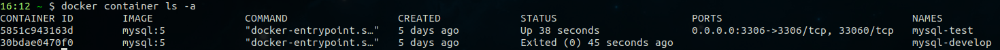
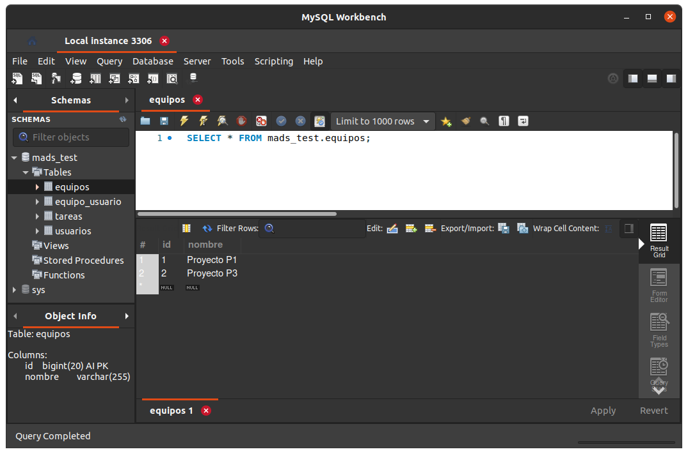

# Documentación técnica práctica 2
## 1. Base de datos MySQL
Tenemos dos bases de datos creadas en contenedores:



El la siguiente imagen se muestra la base de datos MySQL que contiene los datos para tests:



## 2. Nuevas clases y métodos
Para los servicios he creado las clases _EquipoService_ y _EquipoServiceException_ y, para los
controladores, las clases _EquipoController_, _EquipoData_ y _EquipoNotFoundException_.

Los métodos de servicio descritos a continuación para gestionar equipos están en 
_EquipoService_, y los métodos de controlador en _EquipoController_.
### 2.1. Servicios gestión pertenencia a equipos
Crear equipo:
```java
@Transactional
public Equipo nuevoEquipo(String nombreEquipo) {
    Equipo equipo = new Equipo(nombreEquipo);
    equipoRepository.save(equipo);
    return equipo;
}
```
Para añadirse a un equipo, se utiliza el siguiente método de servicio:
```java
@Transactional
public void anyadirAEquipo(Long idUsuario, Long idEquipo) {
    Usuario usuario = usuarioRepository.findById(idUsuario).orElse(null);
    if (usuario == null) {
        throw new EquipoServiceException("Usuario " + idUsuario + " no existe al añadir a equipo " + idEquipo);
    }
    Equipo equipo = equipoRepository.findById(idEquipo).orElse(null);
    if (equipo == null) {
        throw new EquipoServiceException("Equipo " + idEquipo + " no existe al añadirle el usuario " + idUsuario);
    }
    equipo.addUsuario(usuario);
}
```
Como podemos ver, se utiliza el siguiente método de la clase _Equipo_ que añade al usuario
en la lista de usuarios del equipo y al equipo en la lista de equipos del usuario:
```java
public void addUsuario(Usuario usuario) {
    usuarios.add(usuario);
    usuario.getEquipos().add(this);
}
```
Borrarse de un equipo:
```java
@Transactional
public void borrarDeEquipo(Long idUsuario, Long idEquipo) {
    Usuario usuario = usuarioRepository.findById(idUsuario).orElse(null);
    if (usuario == null) {
        throw new EquipoServiceException("Usuario " + idUsuario + " no existe al borrar del equipo " + idEquipo);
    }
    Equipo equipo = equipoRepository.findById(idEquipo).orElse(null);
    if (equipo == null) {
        throw new EquipoServiceException("Equipo " + idEquipo + " no existe al borrarle el usuario " + idUsuario);
    }
    equipo.removeUsuario(usuario);
}
```
Del mismo modo que antes, se utiliza un método en la clase _Equipo_ para actualizar ambos lados
de la relación entre usuario y equipo:
```java
public void removeUsuario(Usuario usuario) {
    usuarios.remove(usuario);
    usuario.getEquipos().remove(this);
}
```
### 2.2. Controladores gestión pertenencia a equipos
Para la creación de equipos nuevos tenemos un método que mapea la petición GET (que devuelve un formulario) y un método
para la petición POST que llama al servicio correspondiente para crear un equipo nuevo:
```java
@GetMapping("/equipos/nuevo")
public String formNuevoEquipo(@ModelAttribute EquipoData equipoData, Model model, HttpSession session) {
    managerUserSesion.comprobarCualquierUsuarioLogeado(session);
    return "formNuevoEquipo";
}

@PostMapping("/equipos/nuevo")
public String nuevoEquipo(@ModelAttribute EquipoData equipoData,
                          Model model, RedirectAttributes flash,
                          HttpSession session) {

    managerUserSesion.comprobarCualquierUsuarioLogeado(session);

    Equipo equipo = equipoService.nuevoEquipo(equipoData.getNombre());
    if (equipoData.getAddUsuario()) {
        equipoService.anyadirAEquipo((Long) session.getAttribute("idUsuarioLogeado"), equipo.getId());
    }
    flash.addFlashAttribute("mensaje", "Equipo creado correctamente");
    return "redirect:/equipos";
}
```
Cabe destacar aquí el uso de la clase _EquipoData_ para almacenar los datos del equipo.

Desde la lista de equipos, un usuario puede, pulsando el mismo botón, darse de alta o de baja en un equipos (en función
de si ya está en el mismo o no). Para ello está el método siguiente:
```java
@GetMapping("/equipos/{id}/alternarPertenencia")
public String alternarPertenenciaEquipo(@PathVariable(value="id") Long idEquipo, Model model, HttpSession session) {
    managerUserSesion.comprobarCualquierUsuarioLogeado(session);
    Long idUsuario = (Long) session.getAttribute("idUsuarioLogeado");

    if (equipoService.usuarioEstaEnEquipo(idUsuario, idEquipo)) {
        equipoService.borrarDeEquipo(idUsuario, idEquipo);
    }
    else {
        equipoService.anyadirAEquipo(idUsuario, idEquipo);
    }
    return "redirect:/equipos";
}
```
Para comprobar si el usuario está o no en el equipo he añadido el método `usuarioEstaEnEquipo` como un servicio (junto
con su test correspondiente). Este método, además, lo necesitaremos llamar desde la vista _listaEquipos_ para que en 
el botón se muestre el texto "Añadirme" o "Borrarme" según corresponda para cada equipo de la lista. La solución que 
se me ha ocurrido para ello ha sido añadir, en el controlador del listado de equipos, la instancia de la clase 
_EquipoService_ que tenemos en la clase controller como atributo a la vista: 
`model.addAttribute("equipoService", equipoService);`. De este modo, desde la vista podemos utilizar el método: 
`th:text="${equipoService.usuarioEstaEnEquipo(session.idUsuarioLogeado, equipo.id)} ? 'Borrarme' : 'Añadirme'"`.
### 2.3. Servicios administración de equipos
Borrar equipo:
```java
@Transactional
public void borrarEquipo(Long idEquipo) {
    Equipo equipo = equipoRepository.findById(idEquipo).orElse(null);
    if (equipo == null) {
        throw new EquipoServiceException("Equipo con id " + idEquipo + " no existe");
    }
    equipoRepository.delete(equipo);
}
```
Modificar equipo:
```java
@Transactional
public Equipo modificarEquipo(Long idEquipo, String nuevoNombre) {
    Equipo equipo = equipoRepository.findById(idEquipo).orElse(null);
    if (equipo == null) {
        throw new EquipoServiceException("Equipo con id " + idEquipo + " no existe");
    }
    equipo.setNombre(nuevoNombre);
    equipoRepository.save(equipo);
    return equipo;
}
```
### 2.4. Controladores administración de equipos
Del mismo modo que para el caso de crear un nuevo equipo, para editar un equipo tenemos un método para el GET que lleva
a un formulario y uno para el POST que llama al servicio que modifica el equipo.
```java
@GetMapping("/equipos/{id}/editar")
public String formEditarEquipo(@PathVariable(value="id") Long idEquipo, @ModelAttribute EquipoData equipoData,
                               Model model, HttpSession session) {

    Equipo equipo = equipoService.findById(idEquipo);
    if (equipo == null) {
        throw new EquipoNotFoundException();
    }
    managerUserSesion.comprobarUsuarioAdmin(session);

    model.addAttribute("equipo", equipo);
    equipoData.setNombre(equipo.getNombre());
    return "formEditarEquipo";
}

@PostMapping("/equipos/{id}/editar")
public String grabaEquipoModificado(@PathVariable(value="id") Long idEquipo, @ModelAttribute EquipoData equipoData,
                                    Model model, RedirectAttributes flash, HttpSession session) {

    Equipo equipo = equipoService.findById(idEquipo);
    if (equipo == null) {
        throw new EquipoNotFoundException();
    }
    managerUserSesion.comprobarUsuarioAdmin(session);

    equipoService.modificarEquipo(idEquipo, equipoData.getNombre());
    flash.addFlashAttribute("mensaje", "Equipo modificado correctamente");
    return "redirect:/equipos";
}
```
Borrado de equipos:
```java
@DeleteMapping("/equipos/{id}")
@ResponseBody
public String borrarTarea(@PathVariable(value="id") Long idEquipo, RedirectAttributes flash, HttpSession session) {
    Equipo equipo = equipoService.findById(idEquipo);
    if (equipo == null) {
        throw new EquipoNotFoundException();
    }

    managerUserSesion.comprobarUsuarioAdmin(session);

    equipoService.borrarEquipo(idEquipo);
    return "";
}
```
## 3. Plantillas thymeleaf modificadas y nuevas
En la plantilla `listaEquipo.html` he añadido un botón para crear un nuevo equipo y que lleva al formulario
correspondiente `formNuevoEquipo.html` el cual contiene:
- Un campo para introducir el nombre del equipo.
- Un _checkbox_ para que el usuario indique si quiere añadirse directamente al equipo.
- Un botón para crear el equipo.
- Un botón para cancelar y volver al listado de equipos.

En la lista de equipos he añadido un botón en cada equipo para que el usuario puede añadirse o borrarse del mismo:
```html
<a class="btn btn-primary btn-xs"
   th:text="${equipoService.usuarioEstaEnEquipo(session.idUsuarioLogeado, equipo.id)} ? 'Borrarme' : 'Añadirme'"
   th:href="@{/equipos/{id}/alternarPertenencia(id=${equipo.id})}">Añadirme/Borrarme</a>
```

Para editar un equipo tenemos un botón que lleva al formulario `formEditarTarea.html` que tiene un campo para introducir 
el nombre nuevo, un botón de submit y otro para cancelar y volver al listado.

El borrado de equipos se realiza del mismo modo que el borrado de tareas, con un botón en la lista que muestra un 
mensaje de confirmación y lanza una petición DELETE mediante ajax:
```html
<button th:if="${session.isAdmin}" class="btn btn-danger btn-xs" onmouseover="" style="cursor: pointer;"
        th:onclick="'del(\'/equipos/' + ${equipo.id} + '\')'">Borrar</button>
```
```html
<script type="text/javascript">
    function del(urlBorrar) {
        if (confirm('¿Estás seguro/a de que quieres borrar el equipo?')) {
            $.ajax({
                url: urlBorrar,
                type: 'DELETE',
                success: function (results) {
                    location.reload();
                }
            });
        }
    }
</script>
```
## 4. Tests
### 4.1. Tests servicios
Los tests de los métodos de servicio se incluyen en el fichero `EquipoServiceTest.java`.

Comprobamos que el servicio _nuevoEquipo_ crea correctamente el quipo en la base de datos.
```java
@Test
Transactional
public void testNuevoEquipo() {
   // GIVEN

   // WHEN
   Equipo equipo = equipoService.nuevoEquipo("Proyecto test A");

   // THEN
   Equipo equipoBaseDatos = equipoService.findById(equipo.getId());
   assertThat(equipoBaseDatos).isNotNull();
   assertThat(equipoBaseDatos.getNombre().equals("Proyecto test A"));
}
```
Para comprobar el funcionamiento del método de servicio que añade a un usuario a un equipo
usamos el siguiente test en el que se comprueban los dos lados de la relación entre el usuario
y el equipo en la base de datos:
```java
@Test
@Transactional
public void testAnyadirAEquipo() {
    // GIVEN
    Usuario usuario = new Usuario("jack.skellington@gmail.com");
    usuario.setPassword("123");
    usuario = usuarioService.registrar(usuario);
    Long idUsuario = usuario.getId();
    Equipo equipo = equipoService.nuevoEquipo("Proyecto Navidad");
    Long idEquipo = equipo.getId();

    // WHEN
    equipoService.anyadirAEquipo(idUsuario, idEquipo);

    // THEN
    Usuario usuarioBD = usuarioService.findById(idUsuario);
    Equipo equipoBD = equipoService.findById(idEquipo);
    assertThat(equipoBD.getUsuarios()).contains(usuarioBD); // Equipo contiene usuario
    assertThat(usuarioBD.getEquipos()).contains(equipoBD);  // Usuario contiene equipo
}
```
Del mismo modo, tenemos un test para comprobar la funcionalidad de borrarse de un equipo:
```java
@Test
@Transactional
public void testBorrarDeEquipo() {
    // GIVEN
    // datos-test.sql
    Usuario usuarioBD = usuarioService.findById(1L);
    Equipo equipoBD = equipoService.findById(1L);
    assertThat(equipoBD.getUsuarios()).contains(usuarioBD);
    assertThat(usuarioBD.getEquipos()).contains(equipoBD);

    // WHEN
    equipoService.borrarDeEquipo(1L, 1L);

    // THEN
    assertThat(equipoBD.getUsuarios()).doesNotContain(usuarioBD);
    assertThat(usuarioBD.getEquipos()).doesNotContain(equipoBD);
}
```
Comprobamos el funcionamiento del servicio para borrar equipos de la base de datos con:
```java
@Test
@Transactional
public void testBorrarEquipo() {
    // GIVEN
    Equipo equipo = equipoService.nuevoEquipo("Proyecto test A");
    Long idEquipo = equipo.getId();

    // WHEN
    equipoService.borrarEquipo(idEquipo);

    // THEN
    assertThat(equipoService.findById(idEquipo)).isNull();
}
```
El test del servicio para modificar equipo es el siguiente:
```java
@Test
@Transactional
public void testModificarEquipo() {
    // GIVEN
    Equipo equipo = equipoService.nuevoEquipo("Proyecto AAA");
    Long idEquipo = equipo.getId();

    // WHEN
    Equipo equipoModificado = equipoService.modificarEquipo(idEquipo, "Proyecto BBB");
    Equipo equipoBD = equipoService.findById(idEquipo);

    // THEN
    assertThat(equipoModificado.getNombre()).isEqualTo("Proyecto BBB");
    assertThat(equipoBD.getNombre()).isEqualTo("Proyecto BBB");
}
```
### 4.2. Tests vistas/controladores
Los tests a las vistas y controladores se incluyen en el fichero `EquipoWebTest.java`.

Comprobamos que el listado de equipos y el listado de usuarios de un equipo se muestran correctamente con
test `listadoEquipo` y `listadoUsuariosEquipo`. Además, probamos que se devuelven correctamente los formularios
para crear y editar equipos:
```java
@Test
public void nuevoEquipoDevuelveForm() throws Exception {
    this.mockMvc.perform(get("/equipos/nuevo"))
            .andDo(print())
            .andExpect(content().string(containsString("action=\"/equipos/nuevo\"")));
}

@Test
public void editarEquipoDevuelveForm() throws Exception {
    Equipo equipo = new Equipo("El equipo A");
    equipo.setId(3L);

    when(equipoService.findById(3L)).thenReturn(equipo);

    this.mockMvc.perform(get("/equipos/3/editar"))
            .andDo(print())
            .andExpect(content().string(allOf(
                    // Contiene la acción para enviar el post a la URL correcta
                    containsString("action=\"/equipos/3/editar\""),
                    // Contiene el texto de la tarea a editar
                    containsString("El equipo A"),
                    // Contiene enlace a listar equipos si se cancela la edición
                    containsString("href=\"/equipos\""))));
}
```
